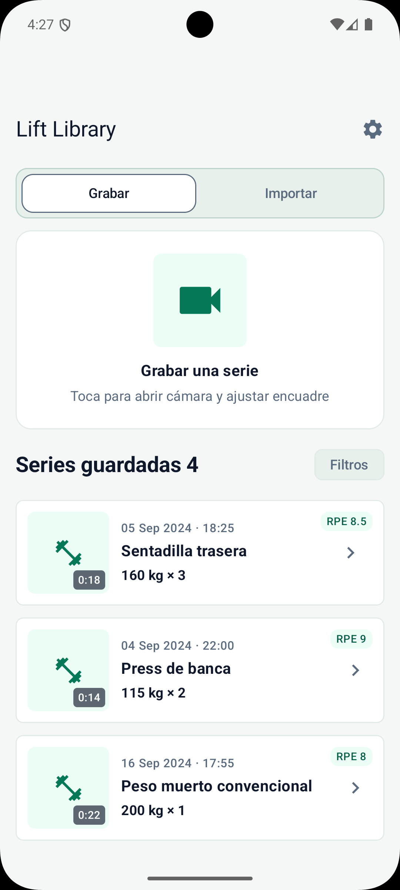

# SetLens

**Review your lifts. Refine your technique.**

SetLens is a native Android application designed to help lifters analyze their training videos, identify technical weaknesses, and improve their lifting technique.

The goal is to turn ordinary workout recordings into a practical tool for structured technique analysis, allowing users to review specific moments, add timestamped observations, and track their progress over time.

## Project Status

**In active development · Pre-MVP**

SetLens is being developed with a product-oriented approach, prioritizing a focused, usable first release before expanding its capabilities.

## Current UI Preview

  

<em>Home screen showing recording mode.</em>

## Tech Stack

- **Language:** Kotlin
- **UI:** Jetpack Compose
- **Platform:** Android
- **Dependency injection:** Koin 4.1

Additional technologies and architectural details will be included as development progresses.

## Development Plan

1. **Foundation** — Establish the initial application structure and core functionality.
2. **MVP** — Deliver a focused, usable experience built around video-based technique analysis.
3. **Release** — Publish the first version on Google Play.
4. **Validation** — Gather real user feedback and evaluate the product's usefulness.
5. **Iteration** — Address issues and improve the experience based on feedback.
6. **Expansion** — Introduce additional capabilities guided by validated user needs.
